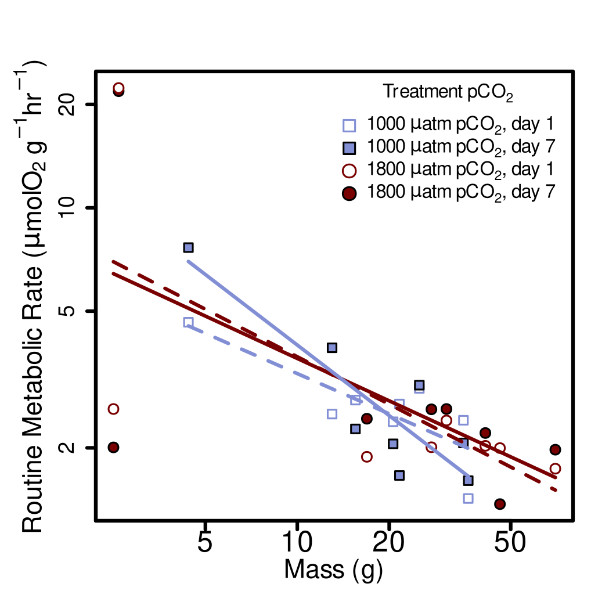

# Reading in libraries
I am reading in the libraries I use for this analysis.  Included among these is the "OTools" package, which was written by Kirt Onthank. This can be install from github using the command: 
```{r, eval=F}
install_github('KirtOnthank\OTools')
```

The install_github command is from the 'remotes' library.


```{r message=FALSE, warning=FALSE}
library(OTools)
library(xlsx)
library(nlme)
library(car)
library(emmeans)
library(respirometry)
library(knitr)
```

# Find the relevant files
This code is meant to find the metabolic rate files in the current directory and sort them into their types.
```{r}
files=list.files(recursive=T)
resp.files=grep(".txt",files,value=T)
pcrit.files=grep("pcrit|pcrti",resp.files,value=T,ignore.case=T)
metab.files=setdiff(resp.files,pcrit.files)
blank.files=grep("blank_only",resp.files,value=T,ignore.case=T)
rmr.files=setdiff(metab.files,blank.files)
rmr.files=rmr.files[!grepl("-ch2.txt|-ch3.txt|-ch4.txt|\\(1\\).txt",rmr.files)]
rmr.files=rmr.files[!duplicated(basename(rmr.files))]
```


# Reading in the data log file
This reads in the data log file, which contains information on octopus mass, flow rate, and other associated information.
```{r}
data.log=read.csv("Muus_Data_Log.csv")
```

# Running the RMR data analysis
First I am going to make a object to put the RMR data into.
```{r}
routine=data.frame(filename=as.character(),
                   spreadsheet_guess=as.character(),
                   octo=as.character(),
                   mass=as.numeric(),
                   pco2=as.numeric(),
                   day=as.numeric(),
                   rmr=as.numeric()
                   )
```


Then I am running a quick check to make sure that we are matching file names of the metabolic runs with the lines in the Data Log file.
```{r}
file_check=as.character()
score=as.numeric()
for (i in 1:length(rmr.files)){
  filename=rmr.files[i]
  guess=which.min(adist(basename(filename),data.log$File.name))
  file_check[i]=data.log$File.name[guess]
  score[i]=min(adist(basename(filename),data.log$File.name))
}

write.csv(cbind(basename(rmr.files),file_check,score),file = "filecheck.csv")
```

Nest, I run the analysis to calculate RMR from each file.  We are discarding the first three hours (using data as resp[resp$times>3600*3,] in the resp.open function) from each run to account for elevated metabolic rate at the beginning of the run.
```{r, eval=FALSE}
column.count=1
for (i in 1:length(rmr.files)){
  filename=rmr.files[i]
  print(paste("starting file ", basename(filename)," (loop",i,")",sep=""))
  if(length(grep("Group 4|presens|ch\\d\\.txt",basename(filename)))>0){
    resp=read.presens(filename)
  }else{
    resp=read.pyro(filename)
  }
  print("finding closest match in log")

guess=which.min(adist(basename(filename),data.log$File.name))
  
    flow=as.numeric(data.log$flow.rate..L.min.[guess])
    mass=as.numeric(data.log$Mass..g.[guess])
    if(is.na(flow)){
      flow=0.1
    }
    if(is.na(mass)){
      mass=10
    }
    print("calculating rmr")
    resp.mean=mean(resp.open(resp[resp$times>3600*3,],
                             flow.rate=flow*1000,
                             weight=mass)$resp,
                   na.rm=T)
    print("writing data to object")
    routine[column.count,1]=basename(filename)
    routine[column.count,2]=data.log$File.name[guess]
    routine[column.count,3]=data.log$octo1[guess]
    routine[column.count,4]=mass

    if(length(grep("1800",filename))>0){
     routine[column.count,5]=1800
    }
    if(length(grep("1000",filename))>0){
      routine[column.count,5]=1000
    }
    routine[column.count,6]=data.log$day[guess]
    routine[column.count,7]=resp.mean
    column.count=column.count+1
    if(sum(is.na(resp$O23))<10&!grepl("blank",filename)){
      print("found second respirometer")
      flow=as.numeric(data.log$Flow.rate.2[guess])
      mass=as.numeric(data.log$Mass.2[guess])
      resp.mean=mean(resp.open(resp[resp$times>3600*3,],
                               inflow=3,
                               outflow=4,
                               flow.rate=flow*1000,
                               weight=mass)$resp,na.rm=T)
      print("writing data to object")
      routine[column.count,1]=basename(filename)
      routine[column.count,2]=data.log$File.name[guess]
      routine[column.count,3]=data.log$octo2[guess]
      routine[column.count,4]=mass
  
      if(length(grep("1800",filename))>0){
       routine[column.count,5]=1800
      }
      if(length(grep("1000",filename))>0){
        routine[column.count,5]=1000
      }
      routine[column.count,6]=data.log$day[guess]
      routine[column.count,7]=resp.mean
      column.count=column.count+1
    }
  print(paste("end of file ", basename(filename)," (loop",i,")",sep=""))
}


```

In order to not need to re-run the analysis each time, I am writing the results out to a .csv, then reading it back in.  I will set both the evaluation of this chunk and the last to FALSE.
```{r, eval=FALSE}
write.csv(routine,"RMR_Results.csv")
```

```{r}
routine=read.csv("RMR_Results.csv")
```


```{r}
routine.table=routine[,4:8]
routine.table=routine.table[order(routine.table$octo),]
colnames(routine.table)=c("Octopus ID",
  "Mass (g)",
  "pCO~2~ ($\\mu$atm)",
  "Day",
  "Routine Metabolic Rate ($\\mu$O~2~ g^-1^ hr^-1^)"
  )
kable(routine.table,align="c",row.names = F)
```


# Running linear effects model

To make the relationship linear between mass and metabolic rate linear, we take the log of both.
```{r}
routine$mass.log=log(routine$mass)
routine$rmr.log=log(routine$rmr)
```


Setting pCO~2~ to factor class:
```{r short_input}
routine$pco2=as.factor(routine$pco2)
```

Next I set orthogonal contrasts:
```{r short_contrast}
contrasts(routine$pco2)=contr.poly(2) 
```

Running the linear mixed effects model and ANOVA using type III sum of squares:
```{r linear mixed effects model}
routine.lme=lme(rmr.log~mass.log*pco2*day,random=~1|octo,
             correlation=corAR1(form=~day|octo),
              data=routine[routine$octo!="2-1",])
routine.anova=Anova(routine.lme,type="III")
```

```{r}
rmr.lme.table=cbind(
  c("Mass","pCO2","Day"),
  round(routine.anova$Chisq[2:4],2),
  routine.anova$Df[2:4],
  round(routine.anova$`Pr(>Chisq)`[2:4],5)
)
colnames(rmr.lme.table)=c("Factor","Chi-square", "DF", "p-value")

kable(rmr.lme.table)
```


# Summary of LME 
```{r}
routine.em=data.frame(emmeans(routine.lme,~pco2+day+mass.log))
routine.em

```
```{r}
emmeans(routine.lme,~pco2)
```


```{r}
rmr.df=
data.frame(cbind(
  as.numeric(as.character(routine.em$pco2)),
  routine.em$day,
  sprintf("%.2f",signif(exp(routine.em$emmean),3)),
  paste(sprintf("%.2f",signif(exp(data.frame(routine.em)$lower.CL),3)),
        "-",
        sprintf("%.2f",signif(exp(data.frame(routine.em)$upper.CL),3)))
))
rmr.df=rmr.df[order(rmr.df[,1]),]
rmr.df
```

```{r}
colnames(rmr.df)=c("pCO~2~ ($\\mu$atm)",
                   "day",
                   "Routine Metabolic Rate ($\\mu$O~2~ g^-1^ hr^-1^)",
                   "RMR 95% CI")
kable(rmr.df,align="c",row.names = F)
```


# Plotting the data
## Predicted values
First I am getting the model predicted values for each treatment between the max an minimum mass values.
```{r}
seq1.1800=seq(from=min(routine$mass.log[routine$pco2==1800]),
              to=max(routine$mass.log[routine$pco2==1800]),
              length.out=100)

df1.1800=data.frame(
  day=rep(1,100),
  mass.log=seq1.1800,
  pco2=as.factor(rep(1800,100))
)
pred1.1800= predict(routine.lme,newdata = df1.1800,level=0)

seq1.1000=seq(from=min(routine$mass.log[routine$pco2==1000]),
              to=max(routine$mass.log[routine$pco2==1000]),
              length.out=100)

df1.1000=data.frame(
  day=rep(1,100),
  mass.log=seq1.1000,
  pco2=as.factor(rep(1000,100))
)

pred1.1000=predict(routine.lme,newdata = df1.1000,level=0)

seq7.1800=seq(from=min(routine$mass.log[routine$pco2==1800]),
              to=max(routine$mass.log[routine$pco2==1800]),
              length.out=100)

df7.1800=data.frame(
  day=rep(7,100),
  mass.log=seq7.1800,
  pco2=as.factor(rep(1800,100))
)

pred7.1800=predict(routine.lme,newdata = df7.1800,level=0)

seq7.1000=seq(from=min(routine$mass.log[routine$pco2==1000]),
              to=max(routine$mass.log[routine$pco2==1000]),
              length.out=100)

df7.1000=data.frame(
  day=rep(7,100),
  mass.log=seq7.1000,
  pco2=as.factor(rep(1000,100))
)

pred7.1000=predict(routine.lme,newdata = df7.1000,level=0)

```

Assigning the colors for the treatments.
```{r}
hi.co2.col="#790000ff"
lo.co2.col="#838fd5ff"
```


Next, I am actually plotting it. 
```{r}
svg(filename="Figure_3.svg",height=3.5,width=3.5,pointsize=6)
par(fig=c(0.04,1,0,1))
plot(rmr~mass,data=routine[routine$octo!="2-1",],log="xy",axes=F,ylab="",xlab="",type="n")
box(lwd=2)
axis(1,lwd=2,cex.axis=2)
axis(2,lwd=2,cex.axis=1.5)
mtext(expression("Routine Metabolic Rate ("*mu*"molO"[2]*" g"^-1*"hr"^-1*")"),
      side=2,cex=1.8,line=2.5)
mtext("Mass (g)",side=1,cex=1.8,line=2.5)

points(rmr~mass,data=routine[routine$pco2==1000&routine$day==1&routine$octo!="2-1",],
       pch=22,bg="white",col=lo.co2.col,cex=1.5)
points(rmr~mass,data=routine[routine$pco2==1000&routine$day==7&routine$octo!="2-1",],
       pch=22,bg=lo.co2.col,cex=1.5)
points(rmr~mass,data=routine[routine$pco2==1800&routine$day==7&routine$octo!="2-1",],
       pch=21,bg=hi.co2.col,cex=1.5)
points(rmr~mass,data=routine[routine$pco2==1800&routine$day==1&routine$octo!="2-1",],
       pch=21,bg="white",col=hi.co2.col,cex=1.5)
lines(exp(seq1.1800),exp(pred1.1800),col=hi.co2.col,lwd=2,lty=2)
lines(exp(seq1.1000),exp(pred1.1000),col=lo.co2.col,lwd=2,lty=2)
lines(exp(seq7.1800),exp(pred7.1800),col=hi.co2.col,lwd=2,lty=1)
lines(exp(seq7.1000),exp(pred7.1000),col=lo.co2.col,lwd=2,lty=1)
legend("topright", c(expression("1000 "*mu*"atm pCO"["2"]*", day 1"),
                     expression("1000 "*mu*"atm pCO"["2"]*", day 7"),
                     expression("1800 "*mu*"atm pCO"["2"]*", day 1"),
                     expression("1800 "*mu*"atm pCO"["2"]*", day 7")),
       pch = c(22,22,21,21),bty="n",title = expression("Treatment pCO"["2"]),
       pt.bg=c("white",lo.co2.col,"white",hi.co2.col),col=c(lo.co2.col,"black",hi.co2.col,"black"),
       inset = .02,cex=1.3,box.lwd=2,pt.lwd=1,pt.cex=2)

dev.off()


```

Converting the image to a png to be displayed in the RMarkdown.
```{bash}
cairosvg Figure_3.svg -o Figure_3.png -d 300
```

Converting to eps for submission.
```{bash}
inkscape Figure_3.svg -o Figure_3.eps --export-ignore-filters --export-ps-level=3
```




# Double checking the emmeans output using the predict() function as a reality check
```{r}
#logmass=log(median(routine$mass))
logmass=2.906025
rmr.df.check=data.frame(pCO2=c(1000,1000,1800,1800),
           day=c(1,7,1,7),
           RMR=round(exp(predict(routine.lme,
                  newdata=data.frame(
                       day=c(1,7,1,7),
                       mass.log=rep(logmass,4),
                       pco2=as.factor(c(1000,1000,1800,1800))),
                     level=0)
                )[1:4],2)
           )

colnames(rmr.df.check)[1]="pCO~2~ ($\\mu$atm)"
colnames(rmr.df.check)[3]="Routine Metabolic Rate ($\\mu$O~2~ g^-1^ hr^-1^)"
kable(rmr.df.check,align="c",row.names=F)

```


# Finding the slopes of the treatments

Here I am producing a table of the slope and intercepts of the linear mixed effects model of routine metabolic rates.  These values correspond to the logged mass and logged RMR, and do not translate to the untransformed data.  The relationship between the untransformed data is not linear, and therefore has no slope. Also, because the log of 0 is infinite, these intercepts correspond instead to a mass of 1g (exp(0)=1).
```{r}
logmass=0
routine.slope=data.frame(pCO2=c(1000,1000,1800,1800),
           Day=c(1,7,1,7),
           Intercept=round(exp(predict(routine.lme,
                  newdata=data.frame(
                       day=c(1,7,1,7),
                       mass.log=rep(logmass,4),
                       pco2=as.factor(c(1000,1000,1800,1800))),
                     level=0)
                )[1:4],2),
           Slope=c(
            round(-1*diff(range(pred1.1000))/diff(range(seq1.1000)),2),
            round(-1*diff(range(pred7.1000))/diff(range(seq7.1000)),2),
            round(-1*diff(range(pred1.1800))/diff(range(seq1.1800)),2),
            round(-1*diff(range(pred7.1800))/diff(range(seq7.1800)),2)
            )
           )

colnames(routine.slope)[1]="pCO~2~ ($\\mu$atm)"
kable(routine.slope,align="c",row.names=F)

```

