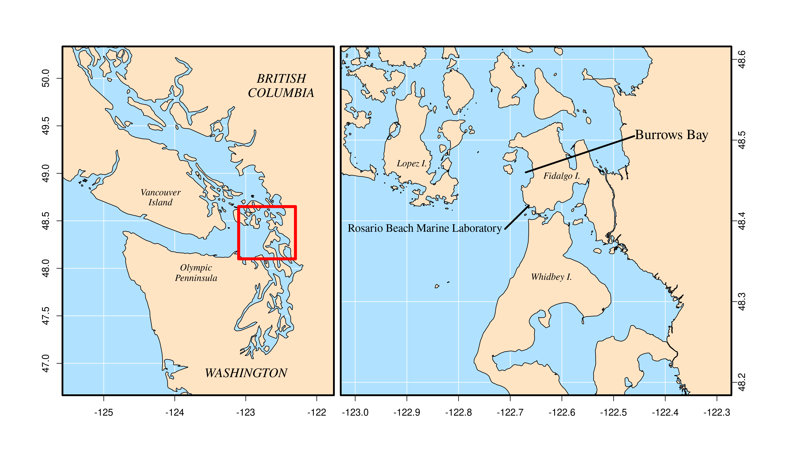

```{r}
library(maptools)
```


```{r}
global.shp=readShapePoly('./Shapefiles/ne_10m_land/ne_10m_land.shp')
minor.shp=readShapePoly('./Shapefiles/ne_10m_minor_islands/ne_10m_minor_islands.shp')
wash.shp=readShapePoly("./Shapefiles/sample.shp")
```


```{r}
tiff("Figure_2.tiff",width=14,height=8,units = "in",res=250)
par(fig=c(0.02,0.45,0,1))
plot(c(-125.44,-121.9),c(46.8,50.2),ylab="",xlab="",axes=F)

rect(par("usr")[1], par("usr")[3],
     par("usr")[2], par("usr")[4],
     col = "lightskyblue1")
abline(h=seq(from=47,to=50,by=0.5),col="white",lwd=1)
abline(v=seq(from=-125,to=-123,by=1),col="white",lwd=1)

plot(global.shp,col="bisque",bg="transparent",add=T,lwd=1)
plot(minor.shp,col="bisque",bg="transparent",add=T,lwd=1)

box(lwd=3)
lines(c(-123.1,-123.1),c(48.1,48.65),col="red",lwd=5)
lines(c(-122.3,-122.3),c(48.1,48.65),col="red",lwd=5)
lines(c(-122.3,-123.1),c(48.1,48.1),col="red",lwd=5)
lines(c(-122.3,-123.1),c(48.65,48.65),col="red",lwd=5)
text(-123.7,48,"Olympic",font=3,family="serif")
text(-123.7,47.9,"Penninsula",font=3,family="serif")
text(-124.2,48.8,"Vancouver",font=3,family="serif")
text(-124.2,48.7,"Island",font=3,family="serif")
text(-122.5,50,"BRITISH",cex=1.4,font=3,family="serif")
text(-122.5,49.85,"COLUMBIA",cex=1.4,font=3,family="serif")
text(-123,46.9,"WASHINGTON",cex=1.4,font=3,family="serif")

axis(1,cex.axis=1,at=c(-125,-124,-123,-122))
axis(2,cex.axis=1)

par(fig=c(0.37,0.95,0,1),new=T)
plot(c(-123,-122.3),c(48.2,48.6),ylab="",xlab="",axes=F)
rect(par("usr")[1], par("usr")[3],
     par("usr")[2], par("usr")[4],
     col = "lightskyblue1")
abline(v=seq(from=-123,to=-122.3,by=0.1),col="white")
abline(h=seq(from=48.2,to=48.6,by=0.1),col="white")
plot(wash.shp,col="bisque",bg="transparent",add=T,lwd=1)
box(lwd=3)
axis(1,cex.axis=1)
axis(4,cex.axis=1,padj=-1)
text(-122.6,48.455,"Fidalgo I.",cex=1,font=3,family="serif")
text(-122.62,48.33,"Whidbey I.",cex=1,font=3,family="serif")
text(-122.89,48.47,"Lopez I.",cex=1,font=3,family="serif")
lines(c(-122.67,-122.46),c(48.46,48.505),lwd=3)
text(-122.47,48.505,pos=4,"Burrows Bay",cex=1.5,family="serif")

lines(c(-122.664,-122.71),c(48.419,48.39),lwd=3)
text(-122.865,48.39,"Rosario Beach Marine Laboratory",cex=1.2,family="serif")

dev.off()

```


```{bash}
convert Figure_2.tiff Figure_2.png
```


