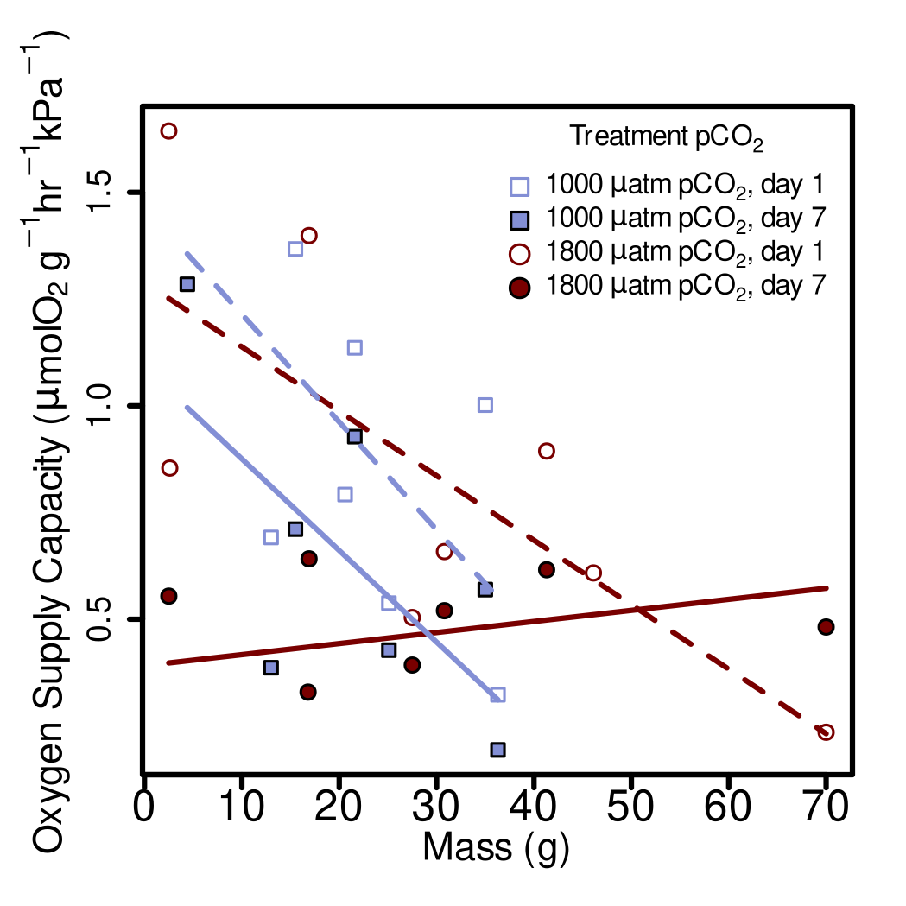

# Loading Libraries

I am reading in the libraries I use for this analysis. Included among these is the "OTools" package, which was written by Kirt Onthank. This can be install from github using the command:

```{r eval=FALSE}
install_github('KirtOnthank/OTools')
```

```{r message=FALSE, warning=FALSE}
library(OTools)
library(respirometry)
library(knitr)
library(nlme)
library(car)
library(emmeans)
```

# Sorting files for P~CRIT~ analysis

```{r}
files=list.files(recursive=T)
resp.files=grep(".txt",files,value=T)
pcrit.files=grep("pcrit|pcrti",resp.files,value=T,ignore.case=T)
pcrit.files=pcrit.files[!duplicated(basename(pcrit.files))]

pcrit.files.read=pcrit.files[!grepl("ch2.txt|ch3.txt|ch4.txt|\\(1\\).txt",pcrit.files)]
pcrit.files.read
```

# Reading in log files

Here I am reading in the log files that will provide additional information needed to analyze the raw data files.

```{r}
pcrit.log=read.csv("pcrit_log.csv")
routine=read.csv("RMR_Results.csv")
```


The file named pcrit_log.csv contains all of the extra information that's needed to analyze the peak crip files exactly the way that we did. This includes the filenames in which the raw oxygen data is stored, the volume of the respirometer in which the analysis was performed in liters (vol), pCO2 in which the analysis was performed (pco2), the day of treatment on which the analysis was performed, where we trimmed the data to eliminate fluctuations at the beginning or the end of the trails (trim_left and trim_right), the identity of the octopus in the respirometer(s) (octo1 and octo2), and the file which contains the routine metabolic rate data which pairs with this analysis (rmr_match). 

Here I am printing out the data in that file into tables to make it easier to view without opening up the CSV file in the directory. However, because of the many columns of data in that file, I need to print it out in four separate tables to make it format well in this PDF. 

```{r}
kable(pcrit.log[,1:6])
kable(pcrit.log[,c(1,7:10)])
kable(pcrit.log[,c(1,11:14)])
kable(pcrit.log[,c(1,15:17)])
```


# Calculating P~CRIT~ from raw data

First I make a empty object where I can place calculated P~CRIT~s

```{r}
pcrits=data.frame(filename=as.character(),
                  spreadsheet_guess=as.character(),
                  octo=as.character(),
                  mass=as.numeric(),
                  pco2=as.numeric(),
                  day=as.numeric(),
                  rmr=as.numeric(),
                  pcrit=as.numeric(),
                  alpha=as.numeric()
                  )

```

Next, I calculate the P~CRIT~ from each data file. Here are a couple of important points on our calculations:

1.  We are using the alpha P~CRIT~ method (Seibel et al, 2021) to calculate P~CRIT~ as implemented by the calc_pcrit() function from the "respirometry" R package (Birk, 2021).
2.  We used the routine metabolic rate that we measured for each individual octopus in this study, unless the maximum metabolic rate measured during the P~CRIT~ run was less than the RMR we had measured. In those cases we used the default MR used by the function, which is "the mean MO2 value from the oxyregulating portion of the curve (as defined by the broken-stick regression)".
3.  Any run in which O~2~ did not drop below 50 mmHgO~2~ was dropped from the analysis. All runs, however, including those dropped, are graphed below.
4.  Oxygen trace of each run is graphed below with the portion used to calculate P~CRIT~ plotted in red.

```{r message=FALSE, warning=FALSE}
co=1

for (i in 1:length(pcrit.files.read)){
  filename=pcrit.files.read[i]  

  if(length(grep("Group 4|presens|ch\\d\\.txt",basename(filename)))>0){
    pcrit.raw=read.presens(filename)
  }else{
    pcrit.raw=read.pyro(filename)
  }

guess=which.min(adist(basename(filename),pcrit.log$filename))  
ch=pcrit.log$ch1[guess]
octo=pcrit.log$octo1[guess]
start=pcrit.log[guess,6+ch]
stop=max(pcrit.raw$times)-pcrit.log[guess,10+ch]
mass=mean(routine$mass[routine$octo==octo])
rmr=mean(routine$rmr[routine$octo==octo])
  
pcrit.working=
  pcrit.raw[
    pcrit.raw$times>start&
    pcrit.raw$times<stop,
  ]
vol=pcrit.log$vol[guess]
drop.time=round((stop-start)/3600,1)
O2.drop=round(diff(range(pcrit.working[,3+ch])),1)
rough.mo2=round((O2.drop*vol)/mass/drop.time,1)

plot(pcrit.raw[,3+ch]~pcrit.raw$times,type="l",main=basename(filename))
points(pcrit.working[,3+ch]~pcrit.working$times,type="l",col="red")
mtext(paste("mass=",mass),side=3,adj=1,line=-1)
mtext(paste0("resp vol=",vol),side=3,adj=1,line=-2)
mtext(paste0("drop time=",drop.time," hr"),side=3,adj=1,line=-3)
mtext(paste0("O2 drop=",O2.drop),side=3,adj=1,line=-4)
mtext(paste0("rough mean MO2=",rough.mo2),side=3,adj=1,line=-5)

pcrit.resp=resp.closed(pcrit.working,volume=pcrit.log$vol[guess],
            weight=mass,smooth="loess",channel=ch,smooth.span = 0.2)

pcrit.bin=aggregate(pcrit.resp$resp~round(pcrit.resp$po2,1),FUN="mean")
colnames(pcrit.bin)=c("po2","resp")

if(max(pcrit.bin$resp)>rmr){
  plot_pcrit(pcrit.bin$po2,pcrit.bin$resp,
           avg_top_n = 3,MR=rmr)   
  if (min(pcrit.working[,3+ch])>50){
      mtext("DROPPED FROM ANALYSIS",line=-5,col="red",cex=3)
      mtext("pO2 did not get low enough",line=-7,col="red",cex=2)
    }
}else{
  plot_pcrit(pcrit.bin$po2,pcrit.bin$resp,
           avg_top_n = 3)
  if (min(pcrit.working[,3+ch])>50){
      mtext("DROPPED FROM ANALYSIS",line=-5,col="red",cex=3)
      mtext("pO2 did not get low enough",line=-7,col="red",cex=2)
    }
}


pcrits[co,1]=basename(filename)
pcrits[co,2]=pcrit.log$filename[guess]
pcrits[co,3]=octo
pcrits[co,4]=mass
pcrits[co,5]=pcrit.log$pco2[guess]
pcrits[co,6]=pcrit.log$day[guess]
pcrits[co,7]=rmr
if (min(pcrit.working[,3+ch])<50){
  if(max(pcrit.bin$resp)>rmr){
  pcrits[co,8]=as.numeric(calc_pcrit(pcrit.bin$po2,pcrit.bin$resp,
           avg_top_n = 3,MR=rmr)[1])
  }else{
    pcrits[co,8]=as.numeric(calc_pcrit(pcrit.bin$po2,pcrit.bin$resp,
           avg_top_n = 3)[1])
  }
  pcrits[co,9]=calc_alpha(pcrit.bin$po2,pcrit.bin$resp,avg_top_n = 3)$alpha
}else{
  pcrits[co,8]=NA
  pcrits[co,9]=NA
}
co=co+1

if(!is.na(pcrit.log$ch2[guess])){
  ch=pcrit.log$ch2[guess]
  octo=pcrit.log$octo2[guess]
  start=pcrit.log[guess,6+ch]
  stop=max(pcrit.raw$times)-pcrit.log[guess,10+ch]
  mass=mean(routine$mass[routine$octo==octo])
  rmr=mean(routine$rmr[routine$octo==octo])
  
  pcrit.working=
    pcrit.raw[
      pcrit.raw$times>start&
      pcrit.raw$times<stop,
    ]

  plot(pcrit.raw[,3+ch]~pcrit.raw$times,type="l",main=basename(filename))
  points(pcrit.working[,3+ch]~pcrit.working$times,type="l",col="red")

  pcrit.resp=resp.closed(pcrit.working,volume=pcrit.log$vol[guess],
            weight=mass,smooth="loess",channel=ch,smooth.span = 0.2)
  pcrit.bin=aggregate(pcrit.resp$resp~round(pcrit.resp$po2,1),FUN="mean")
  colnames(pcrit.bin)=c("po2","resp")

  if(max(pcrit.bin$resp)>rmr){
    plot_pcrit(pcrit.bin$po2,pcrit.bin$resp,
           avg_top_n = 3,MR=rmr)  
    if (min(pcrit.working[,3+ch])>50){
      mtext("DROPPED FROM ANALYSIS",line=-5,col="red",cex=3)
      mtext("pO2 did not get low enough",line=-7,col="red",cex=2)
    }
  }else{
    plot_pcrit(pcrit.bin$po2,pcrit.bin$resp,
           avg_top_n = 3)
    if (min(pcrit.working[,3+ch])>50){
      mtext("DROPPED FROM ANALYSIS",line=-5,col="red",cex=3)
      mtext("pO2 did not get low enough",line=-7,col="red",cex=2)
    }
  }
  

  pcrits[co,1]=basename(filename)
  pcrits[co,2]=pcrit.log$filename[guess]
  pcrits[co,3]=octo
  pcrits[co,4]=mass
  pcrits[co,5]=pcrit.log$pco2[guess]
  pcrits[co,6]=pcrit.log$day[guess]
  pcrits[co,7]=rmr
  if (min(pcrit.working[,3+ch])<50){
    if(max(pcrit.bin$resp)>rmr){
    pcrits[co,8]=as.numeric(calc_pcrit(pcrit.bin$po2,pcrit.bin$resp,
           avg_top_n = 3,MR=rmr)[1])
    }else{
      pcrits[co,8]=as.numeric(calc_pcrit(pcrit.bin$po2,pcrit.bin$resp,
           avg_top_n = 3)[1])
    }
    pcrits[co,9]=calc_alpha(pcrit.bin$po2,pcrit.bin$resp,avg_top_n = 3)$alpha
  }else{
    pcrits[co,8]=NA
  }
  co=co+1
  
}


}

```

Next, I remove the measurements for which the data was excluded (runs did not reach oxygen level of 50 mmHgO~2~). Then I remove the file for which there is no initial data.

```{r}
pcrits=pcrits[complete.cases(pcrits),]
pcrits=pcrits[pcrits$filename!="GR1 Muus1000 pcrit 7-21-21.txt",]
```

```{r}
plot(pcrit~mass,data=pcrits)
```

Complete table of final pcrit and alpha values

```{r}
pcrits.kable=pcrits[,c(3:6,8:9)]
#pcrits.kable$rmr=round(pcrits.kable$rmr,2)
pcrits.kable$pcrit=round(pcrits.kable$pcrit,2)
pcrits.kable$alpha=round(pcrits.kable$alpha,2)
colnames(pcrits.kable)=c("Octopus ID",
                         "mass (g)",
                         "pCO~2~ ($\\mu$atm)",
                         "day",
#                         "Routine Metabolic Rate ($\\mu$O~2~ g^-1^ hr^-1^)",
                         "P~CRIT~ (kPa)",
                         "Oxygen Supply Capacity ($\\alpha$)")
pcrits.kable=pcrits.kable[order(pcrits.kable$day),]
pcrits.kable=pcrits.kable[order(pcrits.kable$`Octopus ID`),]
kable(pcrits.kable,align=c("l",rep("c",4),"r"),row.names = F)
```


# P~CRIT~ Linear mixed effect model

## setting pCO2 to factor class:

```{r short_input}
pcrits$pco2=as.factor(pcrits$pco2)
```

## Next I set orthogonal contrasts:

```{r short_contrast}
contrasts(pcrits$pco2)=contr.poly(2) 
```

## Running the linear mixed effects model and ANOVA using type III sum of squares:

```{r linear mixed effects model}
pcrits.lme=lme(pcrit~mass+pco2+day,random=~1|octo,
             correlation=corAR1(form=~day|octo),
              data=pcrits,na.action=na.omit)

Anova(pcrits.lme,type="III")
```

## Summary of LME

```{r}
pcrit.em=data.frame(emmeans(pcrits.lme,~pco2+day+mass))
pcrit.em

```

```{r}
pcrit.df=
data.frame(cbind(
  as.numeric(as.character(pcrit.em$pco2)),
  pcrit.em$day,
  sprintf("%.2f",signif(pcrit.em$emmean,3)),
  paste(sprintf("%.2f",signif(data.frame(pcrit.em)$lower.CL,3)),
        "-",
        sprintf("%.2f",signif(data.frame(pcrit.em)$upper.CL,3)))
))
pcrit.df=pcrit.df[order(pcrit.df[,1]),]
pcrit.df
```

```{r}
colnames(pcrit.df)=c("pCO~2~ ($\\mu$atm)",
                   "day",
                   "P~CRIT~ (kPa)",
                   "P~CRIT~ 95% CI")
kable(pcrit.df,align="c",row.names = F)
```

# Plotting the Critical Oxygen Pressure results

Assigning the colors for the treatments.

```{r}
hi.co2.col="#790000ff"
lo.co2.col="#838fd5ff"
```

Next, making the figures in SVG format.

```{r}
svg(filename = "Figure_4.svg",width=3.5,height=3.5,pointsize=6)
par(fig=c(0.04,1,0,1))
boxplot(pcrit~pco2+day,data=pcrits,range=0,
        axes=F,col=c(lo.co2.col,hi.co2.col,lo.co2.col,hi.co2.col),ylab="",xlab="")
box(lwd=2)
abline(v=2.5)
axis(1, at=c(1.5,3.5),labels = c("Day 1","Day 7"),tick=F,cex.axis=1.5)
axis(2,at=c(2,4,6,8),cex.axis=1.5)
mtext(expression("Critical Oxygen Pressure (kPa)"),side=2,cex=1.8,line=3)
legend(1,8,pt.bg=c(lo.co2.col,hi.co2.col),legend=c("1000","1800"),
       pch=22,cex=1.3,pt.cex=3.2,bty="n",adj=c(0,0.5),title=expression("pCO"[2]*" ("*mu*"atm)"))
dev.off()
```

Converting the image to a png and jpg to be displayed in the RMarkdown.

```{bash}
cairosvg Figure_4.svg -o Figure_4.png -d 300
convert Figure_4.png Figure_4.jpg
```

Converting to eps for submission.

```{bash}
inkscape Figure_4.svg -o Figure_4.eps --export-ignore-filters --export-ps-level=3
```

{height=50% width=50%}

# Oxygen supply capacity ($\alpha$) linear mixed effect model

## Running the linear mixed effects model and ANOVA using type III sum of squares:

```{r alpha linear mixed effects model}
alpha.lme=lme(alpha~mass*pco2*day,random=~1|octo,
             correlation=corAR1(form=~day|octo),
              data=pcrits,na.action=na.omit)

alpha.anova=Anova(alpha.lme,type="III")
```

```{r}
options(scipen=10)
alpha.lme.table=cbind(
  c("Mass","pCO~2~","Day"),
  round(alpha.anova$Chisq[2:4],2),
  alpha.anova$Df[2:4],
  round(alpha.anova$`Pr(>Chisq)`[2:4],6)
)


colnames(alpha.lme.table)=c("Factor","Chi-square", "DF", "p-value")

kable(alpha.lme.table)
```

## Summary of LME

```{r}
alpha.em=data.frame(emmeans(alpha.lme,~pco2+day+mass))
alpha.em

```

```{r}
alpha.df=
data.frame(cbind(
  as.numeric(as.character(alpha.em$pco2)),
  alpha.em$day,
  sprintf("%.2f",signif(alpha.em$emmean,3)),
  paste(sprintf("%.2f",signif(data.frame(alpha.em)$lower.CL,3)),
        "-",
        sprintf("%.2f",signif(data.frame(alpha.em)$upper.CL,3)))
))
alpha.df=alpha.df[order(alpha.df[,1]),]
alpha.df
```

```{r}
colnames(alpha.df)=c("pCO~2~ ($\\mu$atm)",
                   "day",
                   "Oxygen Supply Capacity ($\\alpha$)",
                   "Oxygen Supply Capacity 95% CI")
kable(alpha.df,align="c",row.names = F)
```


# Oxygen Supply Capacity figure
## Predicted values
First I am getting the model predicted values for each treatment between the max an minimum mass values.
```{r}
seq1.1800=seq(from=min(pcrits$mass[pcrits$pco2==1800]),
              to=max(pcrits$mass[pcrits$pco2==1800]),
              length.out=100)

df1.1800=data.frame(
  day=rep(1,100),
  mass=seq1.1800,
  pco2=as.factor(rep(1800,100))
)
pred1.1800= predict(alpha.lme,newdata = df1.1800,level=0)

seq1.1000=seq(from=min(pcrits$mass[pcrits$pco2==1000]),
              to=max(pcrits$mass[pcrits$pco2==1000]),
              length.out=100)

df1.1000=data.frame(
  day=rep(1,100),
  mass=seq1.1000,
  pco2=as.factor(rep(1000,100))
)

pred1.1000=predict(alpha.lme,newdata = df1.1000,level=0)

seq7.1800=seq(from=min(pcrits$mass[pcrits$pco2==1800]),
              to=max(pcrits$mass[pcrits$pco2==1800]),
              length.out=100)

df7.1800=data.frame(
  day=rep(7,100),
  mass=seq7.1800,
  pco2=as.factor(rep(1800,100))
)

pred7.1800=predict(alpha.lme,newdata = df7.1800,level=0)

seq7.1000=seq(from=min(pcrits$mass[pcrits$pco2==1000]),
              to=max(pcrits$mass[pcrits$pco2==1000]),
              length.out=100)

df7.1000=data.frame(
  day=rep(7,100),
  mass=seq7.1000,
  pco2=as.factor(rep(1000,100))
)

pred7.1000=predict(alpha.lme,newdata = df7.1000,level=0)

```

Assigning the colors for the treatments.
```{r}
hi.co2.col="#790000ff"
lo.co2.col="#838fd5ff"
```


Next, I am actually plotting it. 
```{r}
svg(filename="Figure_5.svg",height=3.5,width=3.5,pointsize=6)
par(fig=c(0.04,1,0,1))
plot(alpha~mass,data=pcrits,axes=F,ylab="",xlab="",type="n")
box(lwd=2)
axis(1,lwd=2,cex.axis=2)
axis(2,lwd=2,cex.axis=1.5)
mtext(expression("Oxygen Supply Capacity ("*mu*"molO"[2]*" g"^-1*"hr"^-1*"kPa"^-1*")"),
      side=2,cex=1.8,line=2.5)
mtext("Mass (g)",side=1,cex=1.8,line=2.5)

points(alpha~mass,data=pcrits[pcrits$pco2==1000&pcrits$day==1,],
       pch=22,bg="white",col=lo.co2.col,cex=1.5)
points(alpha~mass,data=pcrits[pcrits$pco2==1000&pcrits$day==7,],
       pch=22,bg=lo.co2.col,cex=1.5)
points(alpha~mass,data=pcrits[pcrits$pco2==1800&pcrits$day==7,],
       pch=21,bg=hi.co2.col,cex=1.5)
points(alpha~mass,data=pcrits[pcrits$pco2==1800&pcrits$day==1,],
       pch=21,bg="white",col=hi.co2.col,cex=1.5)
lines(seq1.1800,pred1.1800,col=hi.co2.col,lwd=2,lty=2)
lines(seq1.1000,pred1.1000,col=lo.co2.col,lwd=2,lty=2)
lines(seq7.1800,pred7.1800,col=hi.co2.col,lwd=2,lty=1)
lines(seq7.1000,pred7.1000,col=lo.co2.col,lwd=2,lty=1)
legend("topright", c(expression("1000 "*mu*"atm pCO"["2"]*", day 1"),
                     expression("1000 "*mu*"atm pCO"["2"]*", day 7"),
                     expression("1800 "*mu*"atm pCO"["2"]*", day 1"),
                     expression("1800 "*mu*"atm pCO"["2"]*", day 7")),
       pch = c(22,22,21,21),bty="n",title = expression("Treatment pCO"["2"]),
       pt.bg=c("white",lo.co2.col,"white",hi.co2.col),col=c(lo.co2.col,"black",hi.co2.col,"black"),
       inset = .02,cex=1.3,box.lwd=2,pt.lwd=1,pt.cex=2)

dev.off()


```

Converting the image to a png and jpg to be displayed in the RMarkdown.
```{bash}
cairosvg Figure_5.svg -o Figure_5.png -d 300
convert Figure_5.png Figure_5.jpg
```

Converting to eps for submission.
```{bash}
inkscape Figure_5.svg -o Figure_5.eps --export-ignore-filters --export-ps-level=3
```

{height=50% width=50%}

# Finding the slopes of the treatments

Here I am producing a table of the slope and intercepts of the linear mixed effects model of routine metabolic rates.  These values correspond to the logged mass and logged RMR, and do not translate to the untransformed data.  The relationship between the untransformed data is not linear, and therefore has no slope. Also, because the log of 0 is infinite, these intercepts correspond instead to a mass of 1g (exp(0)=1).
```{r}
mass=0
alpha.slope=data.frame(pCO2=c(1000,1000,1800,1800),
           Day=c(1,7,1,7),
           Intercept=round(predict(alpha.lme,
                  newdata=data.frame(
                       day=c(1,7,1,7),
                       mass=rep(mass,4),
                       pco2=as.factor(c(1000,1000,1800,1800))),
                     level=0)
                [1:4],2),
           Slope=c(
            round(-1*(pred1.1000[1]-pred1.1000[length(pred1.1000)])/diff(range(seq1.1000)),3),
            round(-1*(pred7.1000[1]-pred7.1000[length(pred7.1000)])/diff(range(seq7.1000)),3),
            round(-1*(pred1.1800[1]-pred1.1800[length(pred1.1800)])/diff(range(seq1.1800)),3),
            round(-1*(pred7.1800[1]-pred7.1800[length(pred7.1800)])/diff(range(seq7.1800)),3)
            )
           )

colnames(alpha.slope)[1]="pCO~2~ ($\\mu$atm)"
kable(alpha.slope,align="c",row.names=F)

```


# Is there a relationship between RMR and alpha?
One reviewer asked if alpha was correlated with mass or with RMR.  THe previous analysis answers the first part of that question.  Here I attempt to answer the second. I did not include RMR in the linear mixed effects model because there is a well-document relationship between RMR and mass, as can be seen in Figure 3 of this analysis, and I did not want to include a 

```{r}
summary(aov(lm(alpha~rmr,data=pcrits)))
```

With a p-value of 0.493, there appears to be no significant relationship between alpha and rmr.  Here is the graph.

```{r}
plot(alpha~rmr,data=pcrits)
```
It seems the analysis could be significantly influenced by the one very high rmr of over 20.  Just to cover all my bases, we should see if the linear regression is still not significant when that datum is excluded.


```{r}
summary(aov(lm(alpha~rmr,data=pcrits[pcrits$rmr<20,])))
```
It is still not significantly related.  


```{r}
plot(alpha~rmr,data=pcrits[pcrits$rmr<20,])
```


# N values for each measurement for flowchart
```{r}
sum(pcrits$pco2==1000&pcrits$day==1)
sum(pcrits$pco2==1000&pcrits$day==7)
sum(pcrits$pco2==1800&pcrits$day==1)
sum(pcrits$pco2==1800&pcrits$day==7)
```

