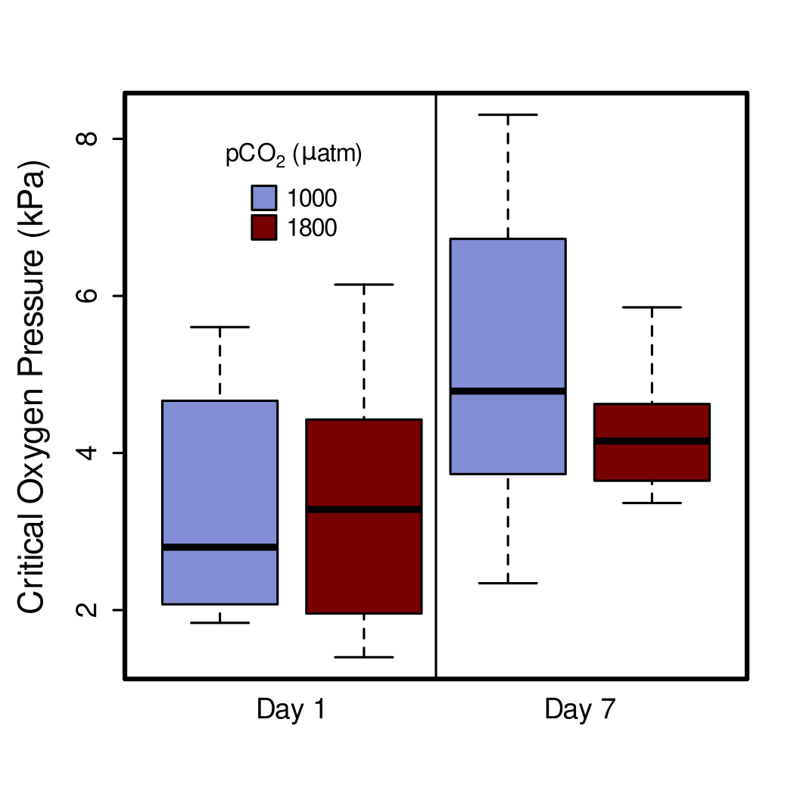

# Loading Libraries
I am reading in the libraries I use for this analysis.  Included among these is the "OTools" package, which was written by Kirt Onthank. This can be install from github using the command: 
```{r eval=FALSE}
install_github('KirtOnthank/OTools')
```


```{r message=FALSE, warning=FALSE}
library(OTools)
library(respirometry)
library(knitr)
library(nlme)
library(car)
library(emmeans)
```

# Sorting files for P~CRIT~ analysis
```{r}
files=list.files(recursive=T)
resp.files=grep(".txt",files,value=T)
pcrit.files=grep("pcrit|pcrti",resp.files,value=T,ignore.case=T)
pcrit.files=pcrit.files[!duplicated(basename(pcrit.files))]

pcrit.files.read=pcrit.files[!grepl("ch2.txt|ch3.txt|ch4.txt|\\(1\\).txt",pcrit.files)]
pcrit.files.read
```

# Reading in log files
Here I am reading in the log files that will provide additional information needed to analyze the raw data files.
```{r}
pcrit.log=read.csv("pcrit_log.csv")
routine=read.csv("RMR_Results.csv")
```

# Calculating P~CRIT~ from raw data
First I make a empty object where I can place calculated P~CRIT~s 
```{r}
pcrits=data.frame(filename=as.character(),
                  spreadsheet_guess=as.character(),
                  octo=as.character(),
                  mass=as.numeric(),
                  pco2=as.numeric(),
                  day=as.numeric(),
                  rmr=as.numeric(),
                  pcrit=as.numeric()
                  )

```

Next, I calculate the P~CRIT~ from each data file.  Here are a couple of important points on our calculations:

1. We are using the alpha P~CRIT~ method (Seibel et al, 2021) to calculate P~CRIT~ as implemented by the calc_pcrit() function from the "respirometry" R package (Birk, 2021).
2. We used the routine metabolic rate that we measured for each individual octopus in this study, unless the maximum metabolic rate measured during the P~CRIT~ run was less than the RMR we had measured. In those cases we used the default MR used by the function, which is "the mean MO2 value from the oxyregulating portion of the curve (as defined by the broken-stick regression)". 
3. Any run in which O~2~ did not drop below 50 mmHgO~2~ was dropped from the analysis. All runs, however, including those dropped, are graphed below.
4. Oxygen trace of each run is graphed below with the portion used to calculate P~CRIT~ plotted in red.
```{r message=FALSE, warning=FALSE}
co=1

for (i in 1:length(pcrit.files.read)){
  filename=pcrit.files.read[i]  

  if(length(grep("Group 4|presens|ch\\d\\.txt",basename(filename)))>0){
    pcrit.raw=read.presens(filename)
  }else{
    pcrit.raw=read.pyro(filename)
  }

guess=which.min(adist(basename(filename),pcrit.log$filename))  
ch=pcrit.log$ch1[guess]
octo=pcrit.log$octo1[guess]
start=pcrit.log[guess,6+ch]
stop=max(pcrit.raw$times)-pcrit.log[guess,10+ch]
mass=mean(routine$mass[routine$octo==octo])
rmr=mean(routine$rmr[routine$octo==octo])
  
pcrit.working=
  pcrit.raw[
    pcrit.raw$times>start&
    pcrit.raw$times<stop,
  ]
vol=pcrit.log$vol[guess]
drop.time=round((stop-start)/3600,1)
O2.drop=round(diff(range(pcrit.working[,3+ch])),1)
rough.mo2=round((O2.drop*vol)/mass/drop.time,1)

plot(pcrit.raw[,3+ch]~pcrit.raw$times,type="l",main=basename(filename))
points(pcrit.working[,3+ch]~pcrit.working$times,type="l",col="red")
mtext(paste("mass=",mass),side=3,adj=1,line=-1)
mtext(paste0("resp vol=",vol),side=3,adj=1,line=-2)
mtext(paste0("drop time=",drop.time," hr"),side=3,adj=1,line=-3)
mtext(paste0("O2 drop=",O2.drop),side=3,adj=1,line=-4)
mtext(paste0("rough mean MO2=",rough.mo2),side=3,adj=1,line=-5)

pcrit.resp=resp.closed(pcrit.working,volume=pcrit.log$vol[guess],
            weight=mass,smooth="loess",channel=ch,smooth.span = 0.2)

pcrit.bin=aggregate(pcrit.resp$resp~round(pcrit.resp$po2,1),FUN="mean")
colnames(pcrit.bin)=c("po2","resp")

if(max(pcrit.bin$resp)>rmr){
  plot_pcrit(pcrit.bin$po2,pcrit.bin$resp,
           avg_top_n = 3,MR=rmr)   
}else{
  plot_pcrit(pcrit.bin$po2,pcrit.bin$resp,
           avg_top_n = 3)
}


pcrits[co,1]=basename(filename)
pcrits[co,2]=pcrit.log$filename[guess]
pcrits[co,3]=octo
pcrits[co,4]=mass
pcrits[co,5]=pcrit.log$pco2[guess]
pcrits[co,6]=pcrit.log$day[guess]
pcrits[co,7]=rmr
if (min(pcrit.working[,3+ch])<50){
  if(max(pcrit.bin$resp)>rmr){
  pcrits[co,8]=as.numeric(calc_pcrit(pcrit.bin$po2,pcrit.bin$resp,
           avg_top_n = 3,MR=rmr)[1])
  }else{
    pcrits[co,8]=as.numeric(calc_pcrit(pcrit.bin$po2,pcrit.bin$resp,
           avg_top_n = 3)[1])
  }
}else{
  pcrits[co,8]=NA
}
co=co+1

if(!is.na(pcrit.log$ch2[guess])){
  ch=pcrit.log$ch2[guess]
  octo=pcrit.log$octo2[guess]
  start=pcrit.log[guess,6+ch]
  stop=max(pcrit.raw$times)-pcrit.log[guess,10+ch]
  mass=mean(routine$mass[routine$octo==octo])
  rmr=mean(routine$rmr[routine$octo==octo])
  
  pcrit.working=
    pcrit.raw[
      pcrit.raw$times>start&
      pcrit.raw$times<stop,
    ]

  plot(pcrit.raw[,3+ch]~pcrit.raw$times,type="l",main=basename(filename))
  points(pcrit.working[,3+ch]~pcrit.working$times,type="l",col="red")

  pcrit.resp=resp.closed(pcrit.working,volume=pcrit.log$vol[guess],
            weight=mass,smooth="loess",channel=ch,smooth.span = 0.2)
  pcrit.bin=aggregate(pcrit.resp$resp~round(pcrit.resp$po2,1),FUN="mean")
  colnames(pcrit.bin)=c("po2","resp")

  if(max(pcrit.bin$resp)>rmr){
    plot_pcrit(pcrit.bin$po2,pcrit.bin$resp,
           avg_top_n = 3,MR=rmr)   
  }else{
    plot_pcrit(pcrit.bin$po2,pcrit.bin$resp,
           avg_top_n = 3)
  }

  pcrits[co,1]=filename
  pcrits[co,2]=pcrit.log$filename[guess]
  pcrits[co,3]=octo
  pcrits[co,4]=mass
  pcrits[co,5]=pcrits$pco2[guess]
  pcrits[co,6]=pcrits$day[guess]
  pcrits[co,7]=rmr
  if (min(pcrit.working[,3+ch])<50){
    if(max(pcrit.bin$resp)>rmr){
    pcrits[co,8]=as.numeric(calc_pcrit(pcrit.bin$po2,pcrit.bin$resp,
           avg_top_n = 3,MR=rmr)[1])
    }else{
      pcrits[co,8]=as.numeric(calc_pcrit(pcrit.bin$po2,pcrit.bin$resp,
           avg_top_n = 3)[1])
    }
  }else{
    pcrits[co,8]=NA
  }
  co=co+1
  
}


}

```

Next, I remove the measurements for which the data was excluded (runs did not reach oxygen level of 50 mmHgO~2~).   Then I remove the file for which there is no initial data.
```{r}
pcrits=pcrits[complete.cases(pcrits),]
pcrits=pcrits[pcrits$filename!="GR1 Muus1000 pcrit 7-21-21.txt",]
```


```{r}
plot(pcrit~mass,data=pcrits)
```

# Linear mixed effect model

## setting pCO2 to factor class:
```{r short_input}
pcrits$pco2=as.factor(pcrits$pco2)
```

## Next I set orthogonal contrasts:
```{r short_contrast}
contrasts(pcrits$pco2)=contr.poly(2) 
```

## Running the linear mixed effects model and ANOVA using type III sum of squares:
```{r linear mixed effects model}
pcrits.lme=lme(pcrit~mass+pco2+day,random=~1|octo,
             correlation=corAR1(form=~day|octo),
              data=pcrits,na.action=na.omit)

Anova(pcrits.lme,type="III")
```


# Summary of LME 
```{r}
pcrit.em=data.frame(emmeans(pcrits.lme,~pco2+day+mass))
pcrit.em

```


```{r}
pcrit.df=
data.frame(cbind(
  as.numeric(as.character(pcrit.em$pco2)),
  pcrit.em$day,
  sprintf("%.2f",signif(pcrit.em$emmean,3)),
  paste(sprintf("%.2f",signif(data.frame(pcrit.em)$lower.CL,3)),
        "-",
        sprintf("%.2f",signif(data.frame(pcrit.em)$upper.CL,3)))
))
pcrit.df=pcrit.df[order(pcrit.df[,1]),]
pcrit.df
```

```{r}
colnames(pcrit.df)=c("pCO~2~ ($\\mu$atm)",
                   "day",
                   "P~CRIT~ (kPa)",
                   "P~CRIT~ 95% CI")
kable(pcrit.df,align="c",row.names = F)
```


# Plotting the Critical Oxygen Pressure results

Assigning the colors for the treatments.
```{r}
hi.co2.col="#790000ff"
lo.co2.col="#838fd5ff"
```

Next, making the figures in SVG format.
```{r}
svg(filename = "Figure_4.svg",width=3.5,height=3.5,pointsize=6)
par(fig=c(0.04,1,0,1))
boxplot(pcrit~pco2+day,data=pcrits,range=0,
        axes=F,col=c(lo.co2.col,hi.co2.col,lo.co2.col,hi.co2.col),ylab="",xlab="")
box(lwd=2)
abline(v=2.5)
axis(1, at=c(1.5,3.5),labels = c("Day 1","Day 7"),tick=F,cex.axis=1.5)
axis(2,at=c(2,4,6,8),cex.axis=1.5)
mtext(expression("Critical Oxygen Pressure (kPa)"),side=2,cex=1.8,line=3)
legend(1,8,pt.bg=c(lo.co2.col,hi.co2.col),legend=c("1000","1800"),
       pch=22,cex=1.3,pt.cex=3.2,bty="n",adj=c(0,0.5),title=expression("pCO"[2]*" ("*mu*"atm)"))
dev.off()
```
Converting the image to a png to be displayed in the RMarkdown.
```{bash}
cairosvg Figure_4.svg -o Figure_4.png -d 300
```

Converting to eps for submission.
```{bash}
inkscape Figure_4.svg -o Figure_4.eps --export-ignore-filters --export-ps-level=3
```



